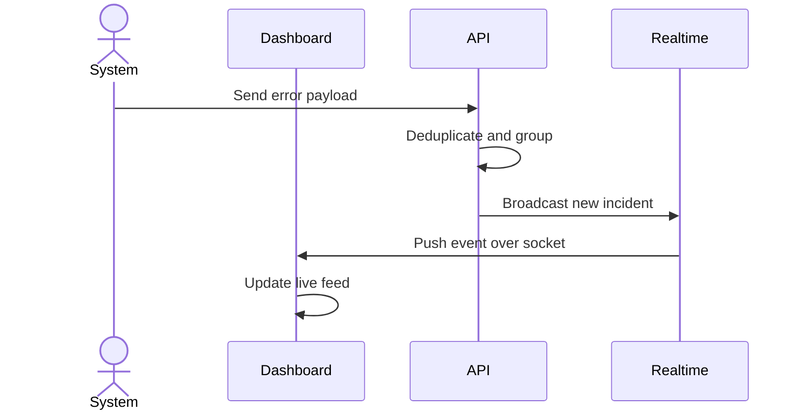
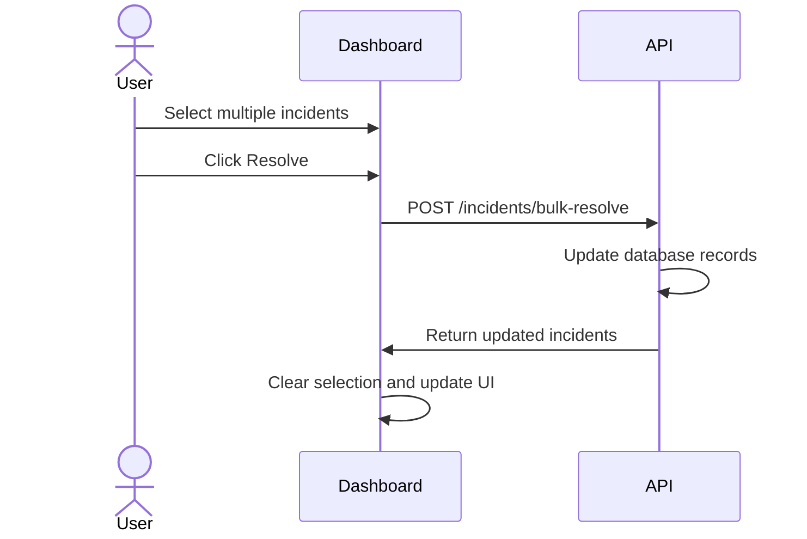

# TrazeIQ

TrazeIQ helps engineering teams track, manage, and resolve application errors before customers complain. It groups noisy crash loops into single incidents and provides real-time dashboards so developers can pinpoint root causes instantly without digging through endless logs.

## System Architecture


## Getting Started

Follow these steps to set up the TrazeIQ frontend on your local machine.

1. Clone the Repository:
```bash
git clone https://github.com/FavourDarasimi/TrazeIQ-Frontend.git
```

2. Navigate into the project directory:
```bash
cd TrazeIQ-Frontend
```

3. Install the dependencies:
```bash
npm install
```

4. Configure your environment variables. Create a `.env.local` file in the root directory and add your external service keys:
```bash
NEXT_PUBLIC_PUSHER_KEY=your_pusher_key
NEXT_PUBLIC_PUSHER_CLUSTER=your_pusher_cluster
NEXT_PUBLIC_GOOGLE_CLIENT_ID=your_google_client_id
```

5. Start the development server:
```bash
npm run dev
```

Open `http://localhost:3000` in your browser to view the application.

## Usage

Once the application is running, create an organization and your first project through the onboarding flow. The dashboard will provide you with a unique project API key.

You can then send test events directly to your backend ingestion API using a standard HTTP client. The dashboard will instantly update to show the new incident, deduplicating any repeated events automatically. Navigate to the incidents tab to assign the issue to a team member, change its severity, or mark it as resolved.

## Features

* **Incident Deduplication and Grouping**
  Incoming crash events are fingerprinted and aggregated automatically. Thousands of repeat occurrences collapse into a single actionable incident to keep your workspace clean.

* **Real-time Monitoring Dashboard**
  The command center pushes live updates directly to the browser. As new errors occur, the UI updates instantly without requiring a page refresh.



* **Advanced Stack Trace Visualization**
  Every incident includes fully parsed stack traces, request metadata, and environmental context. This allows engineering teams to identify the exact line of code causing the failure.

* **Bulk Incident Management**
  Select multiple incidents at once to quickly resolve, ignore, assign, or adjust severities in a single click.



* **Platform Administration Console**
  Staff operators have access to a dedicated admin portal to monitor platform health, track workspace creation, and review global event ingestion metrics across all tenants.

## Technologies Used

| Category | Technology |
| :--- | :--- |
| **Framework** | Next.js |
| **UI Library** | React |
| **Language** | TypeScript |
| **Styling** | Tailwind CSS |
| **Animations** | Framer Motion |
| **Data Visualization** | Recharts |
| **Real-time Sync** | Pusher |

## Contributing

Contributions are always welcome. To contribute, please fork the repository, create a new branch for your feature or bug fix, and submit a pull request for review. Ensure your code follows the existing style conventions and passes all linting checks.

## Author Info

* X (Twitter): https://x.com/code_with_dara

<br />

[](https://nextjs.org/)
[](https://reactjs.org/)
[](https://www.typescriptlang.org/)
[](https://tailwindcss.com/)
[](https://www.framer.com/motion/)

[](https://dokugen.samueltuoyo.com)